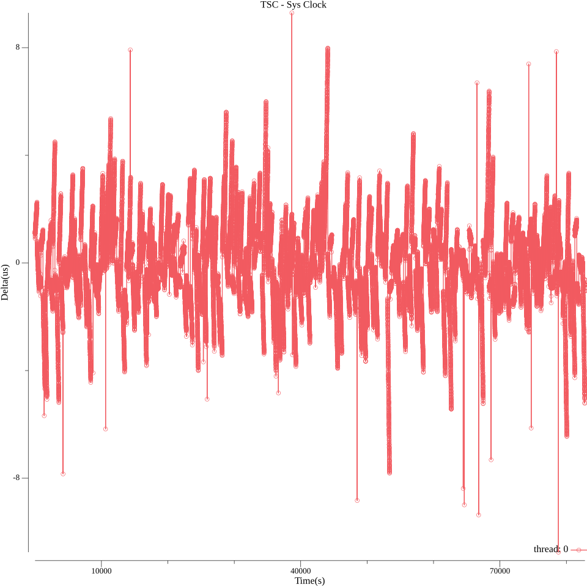

# TSC - High-Performance Unix Time in Go
TSC is a Go library that provides extremely low-latency, high-precision Unix timestamps using the processor's Time Stamp Counter register. It's 6-10x faster than and can significantly improve performance for time-sensitive applications. `time.Now().UnixNano()`
## Table of Contents
- [Overview](#overview)
- [Key Features](#key-features)
- [Getting Started](#getting-started)
- [Use Cases](#use-cases)
- [Performance Comparison](#performance-comparison)
- [Clock Drift Analysis](#clock-drift-analysis)
- [Best Practices](#best-practices)
- [Virtual Machine Support](#virtual-machine-support)
- [Limitations](#limitations)
- [References](#references)
- [Related Projects](#related-projects)

## Overview
TSC leverages the processor's Time Stamp Counter (TSC) register to provide extremely fast timestamp generation. With Invariant TSC support, the library offers reliable frequency measurements across multiple cores/CPUs, delivering timestamps with sub-10ns overhead.
Unlike the system clock, TSC provides stable invocation costs and higher precision, while still maintaining calibration with the wall clock to minimize drift.

 

( `abs(system_clock - tsc_clock)` for each second min: 0.00us, max: 10.75us, mean: 1.18us within 82,800 seconds)

## Key Features
- **Blazing fast**: 6-10x faster than standard `time.Now().UnixNano()`
- **High precision**: Better precision than kernel implementations
- **Stable overhead**: Consistent cost for each invocation (under 10ns)
- **Auto-calibration**: Periodically aligns with the system clock
- **Cross-platform compatibility**: Falls back to standard time functions when TSC isn't supported

## Getting Started

### Basic Usage

``` go
package main

import (
	"fmt"
	"github.com/templexxx/tsc"
)

func main() {
	ts := tsc.UnixNano()   // Getting unix nano timestamp
	fmt.Println(ts, tsc.Supported())  // Print result & whether TSC is supported
}
```

### With Calibration

Here is an [example of using TSC with calibration](examples/with-calibration.go)

## Use Cases
TSC is ideal for applications where timestamp performance matters:
1. High-performance logging systems (timestamp field generation)
2. Benchmarking and performance measurement
3. Low-latency applications with frequent timestamp needs
4. Cloud-native applications with performance constraints

## Performance Comparison

| OS             | CPU                  | time.Now().UnixNano() ns/op | tsc.UnixNano() ns/op | Improvement |
|----------------|----------------------|-----------------------------|----------------------|-------------|
| macOS Catalina | Intel Core i7-7700HQ | 72.8                        | 7.65                 | 89.49%      |
| Ubuntu 18.04   | Intel Core i5-8250U  | 47.7                        | 8.41                 | 82.36%      |
| Ubuntu 20.04   | Intel Core i9-9920X  | 36.5                        | 6.19                 | 83.04%      |
| Fedora 40      | Intel Core i7-12700K | 22.34                       | 5.81                 | 73.99%      |
| Fedora 41      | AMD Ryzen 9 7950X3D  | 29.81                       | 6.27                 | 78.97%      |

## Clock Drift Analysis
TSC provides tools to analyze the stability and drift characteristics in your environment:

- **Linux testing**: Demonstrates how the library handles frequency variations on different hardware qualities. For modern hardware, drift is about 1μs for long-term running.
- **macOS testing**: Shows excellent stability with minimal drift within 1μs
- **Windows testing**: Have not been tested yet. May need High-resolution timer support for calibration
- **Calibration effects**: Visualizations showing how periodic calibration minimizes long-term drift

Detailed drift analysis charts are available in the [tools/longdrift](tools/longdrift/README.md) directory.
## Best Practices
1. **Periodic calibration**: Call every 5 minutes to align with system clock (NTP adjustments typically occur every 11 minutes) `tsc.Calibrate()`
2. **Verify stability**: Use provided tools to verify TSC stability in your environment
3. **Ordered execution**: Use when measuring execution time of short code segments `tsc.ForbidOutOfOrder()`
4. **Fallback awareness**: Check to know if the hardware TSC is being used or if standard time functions are the fallback `tsc.Supported()`

## Virtual Machine Support
When running in virtualized environments:
- Some cloud providers handle TSC clock source correctly (like AWS EC2)
- Feature detection may be limited by CPUID restrictions in VMs
- TSC will be used as clock source when detected as the system clock source
- Verify with your VM provider before deploying in production

## Limitations
1. **Platform support**: Best results on Linux with Intel Enterprise CPUs
2. **Hardware quality**: Consumer-grade crystals may show higher drift
3. **VM uncertainty**: Behavior in virtualized environments depends on provider implementation

## References
1. [Linux gettimeofday implementation details](https://stackoverflow.com/questions/13230719/how-is-the-microsecond-time-of-linux-gettimeofday-obtained-and-what-is-its-acc)
2. [TSC frequency variations with temperature](https://community.intel.com/t5/Software-Tuning-Performance/TSC-frequency-variations-with-temperature/td-p/1098982)
3. [Further analysis of TSC temperature effects](https://community.intel.com/t5/Software-Tuning-Performance/TSC-frequency-variations-with-temperature/m-p/1126518)
4. [Pitfalls of TSC Usage](http://oliveryang.net/2015/09/pitfalls-of-TSC-usage)

## Related Projects
- [Rust TSC implementation (rtsc)](https://github.com/templexxx/rtsc)
