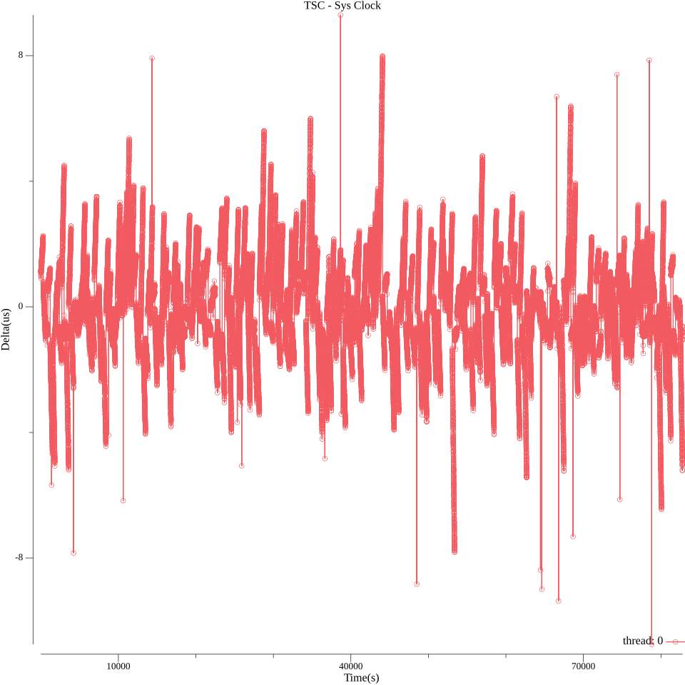
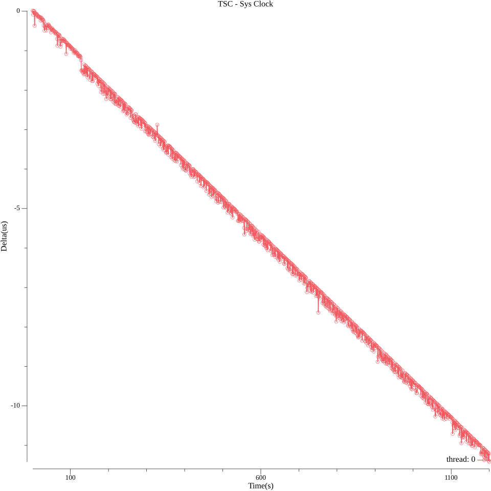
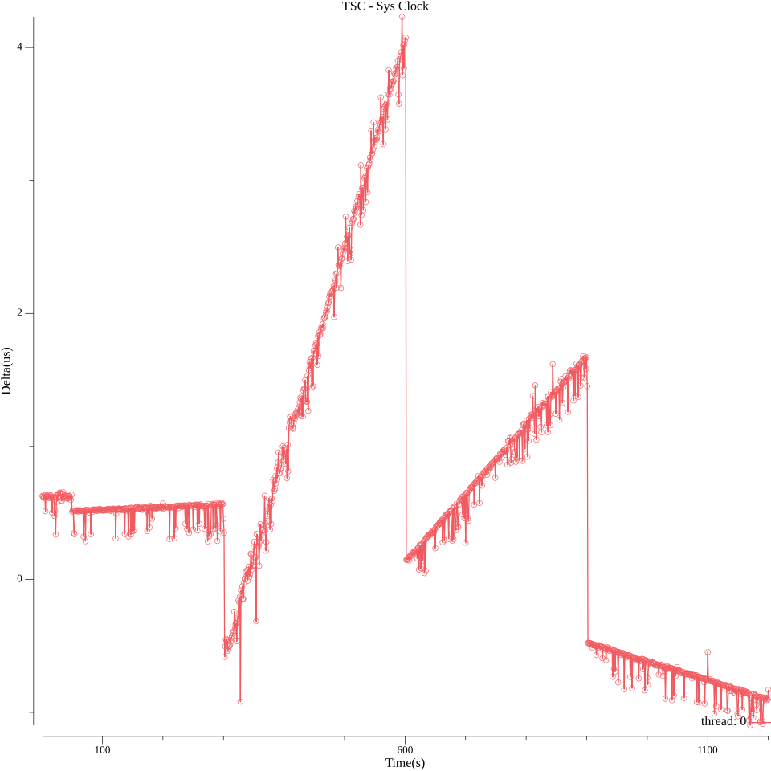
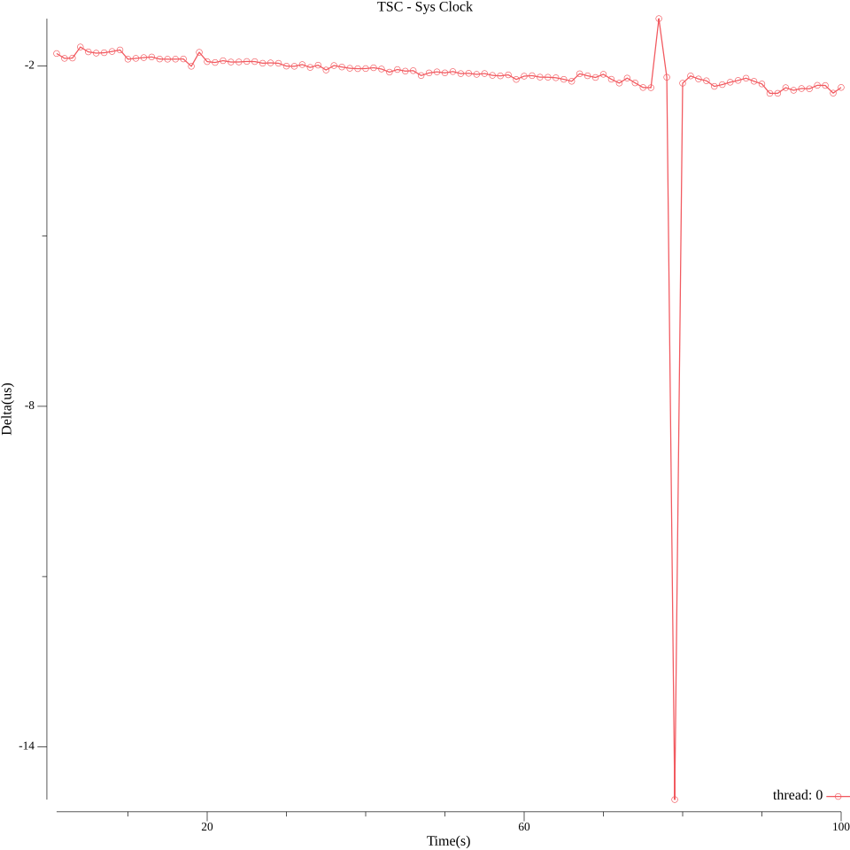
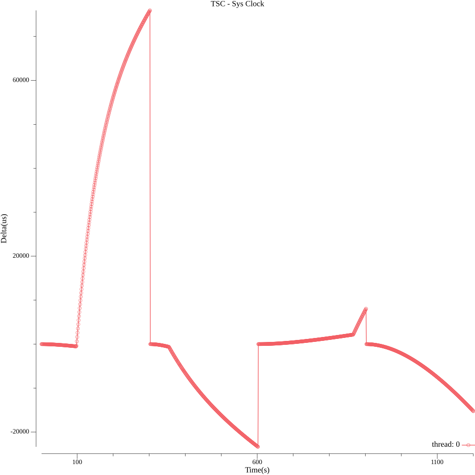
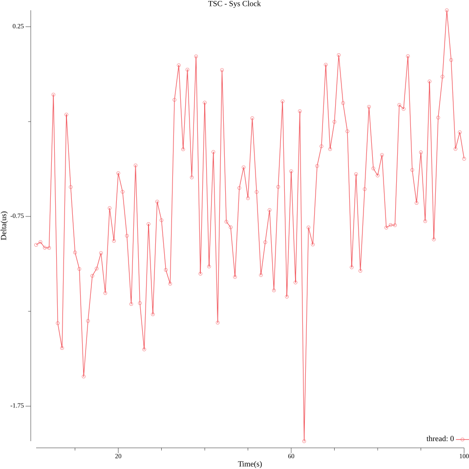
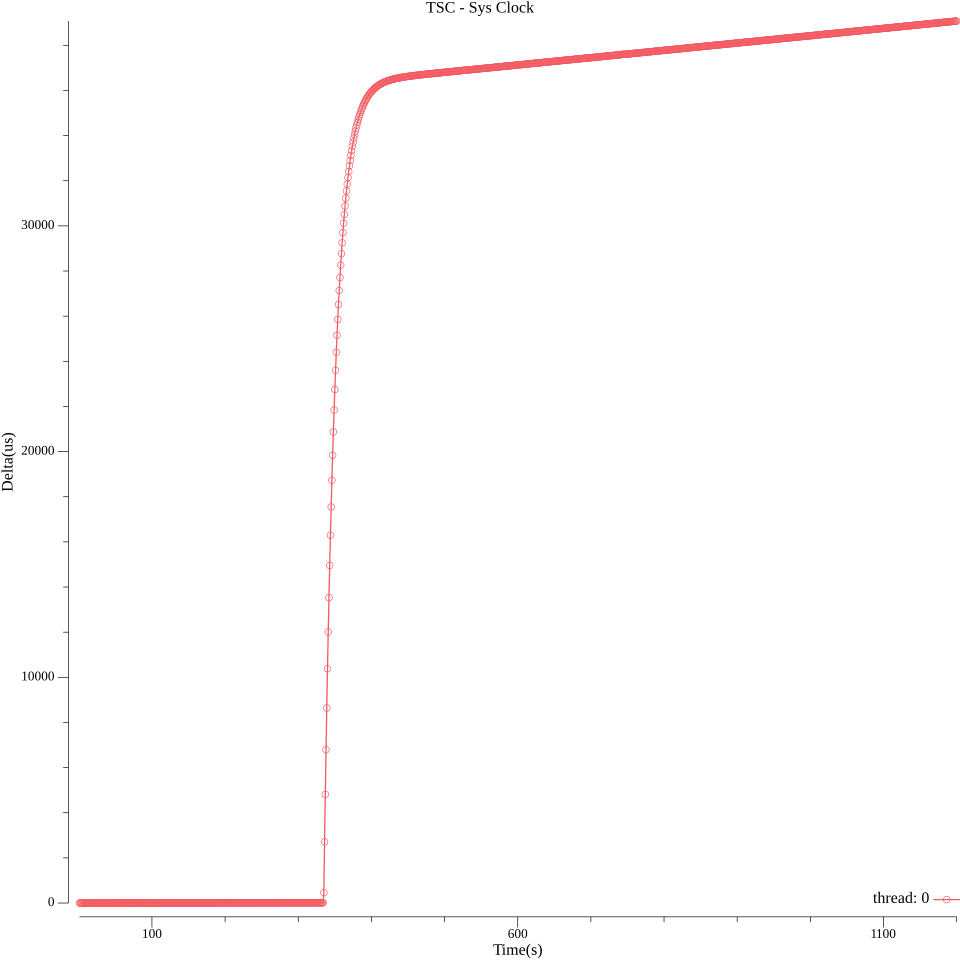

LongDrift
===

longdrift is a tool built for to check TSC clock's drift.

The accuracy and stability of a TSC clock majorly depend on the CPU and frequency of auto calibration.

### Drift testing examples

Delta of tsc clock and system clock for each second.

### Linux(1)

platform: Fedora 41, AMD Ryzen 9 7950X3D
1. testing time: 82,800 seconds (with Calibrate every 5 mins):
```shell
./longdrift --enable_calibrate=true --job_time=82800
job start at: 2025-04-26T01:46:37.100077215+08:00
testing with options: -calibrate_interval 300 -cmp_sys false -coeff 0 -enable_calibrate true -idle true -in_order false -job_time 82800 -print false -threads 1
cpu: 19_61H_2, begin with tsc_freq: 4200049623.1846308708190918(coeff: 0.2380924250227700), offset: 1745054585295363584
[thread-0] delta(abs): first: 1.10us, last: 1.05us, min: 0.00us, max: 10.75us, mean: 1.18us
job taken: 23h0m29.119050804s
```
   
2. testing time: 20 mins
   
3. testing time: 20 mins (with Calibrate every 5 mins)
   


### Linux(2)

The result is not that good. We could find the crystal frequency wasn't stable enough;

platform: Ubuntu 18.04, Intel Core i5-8250U

1. testing time: 100s



2. testing time: 20mins


3. testing time: 20mins (with Calibrate every 5mins)



4. testing time: 21mins (with Calibrate every 5mins)


### macOS

platform: macOS Catalina, Intel Core i7-7700HQ

1. testing time: 100s



2. testing time: 20mins



3. testing time: 20mins (with Calibrate every 5mins)


